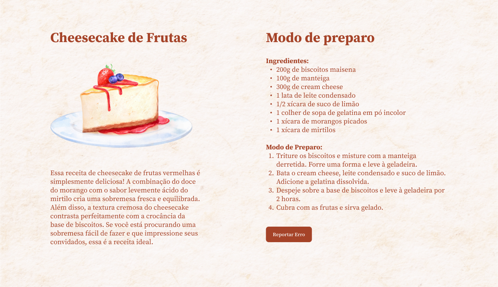
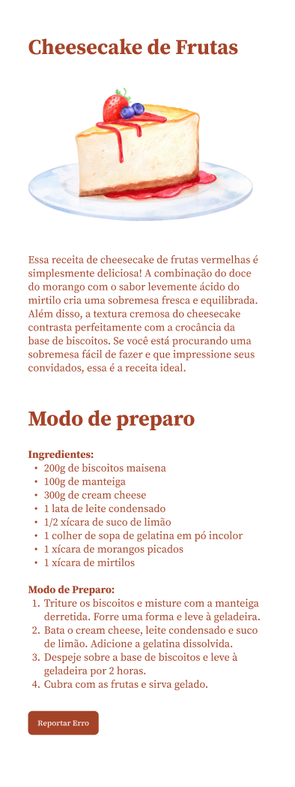

<h1 align="center">Projeto Cheesecake</h1>

  <a href="#-tecnologias">Tecnologias</a>&nbsp;&nbsp;&nbsp;|&nbsp;&nbsp;&nbsp;
  <a href="#-projeto">Projeto</a>&nbsp;&nbsp;&nbsp;|&nbsp;&nbsp;&nbsp;
  <a href="#-layout">Layout</a>

 

## 🚀 Tecnologias

Esse projeto foi desenvolvido com as seguintes tecnologias:

- HTML e CSS
- Git e Github
- Figma

## 💻 Projeto

O Projeto Cheesecake é um site criado para uma visualização agradável de receitas, com resposividade para desktop e mobile.

## 🔖 Layout

Você pode visualizar o layout do projeto através [DESSE LINK](https://www.figma.com/design/ztVYHDpr4qxpZbzM6aonhC/Cheesecake-%E2%80%A2-Projeto-Explorer-(Community)?m=auto&t=UvfEOsr2jgOFztsk-6). É necessário ter conta no [Figma](https://figma.com) para acessá-lo.

  
   
  

---

Protótipo criado pela Rocketseat